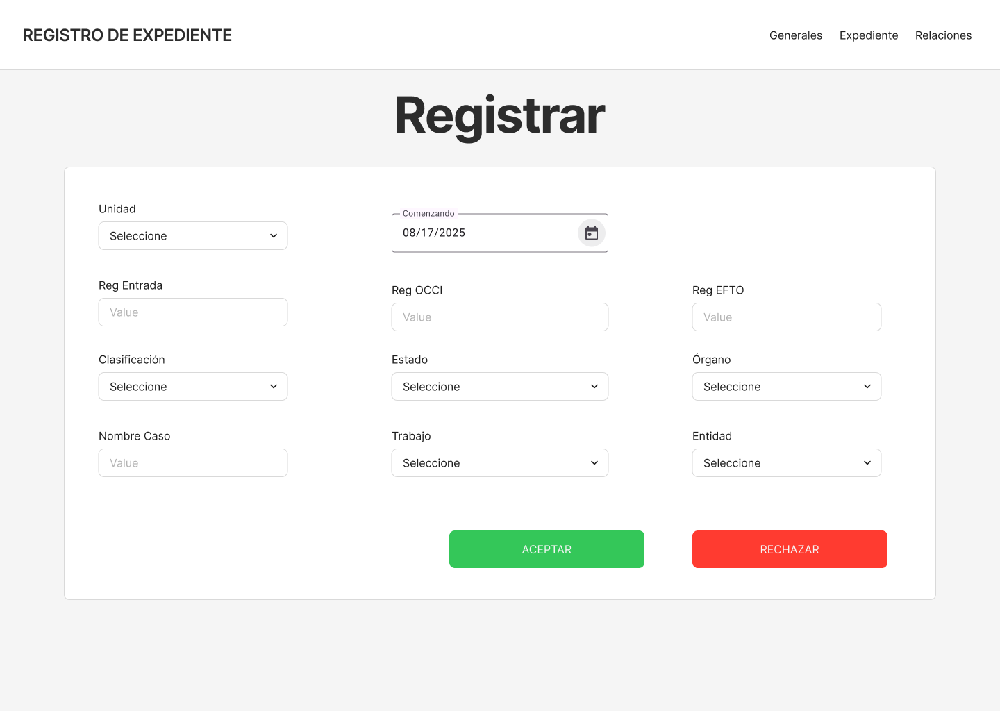
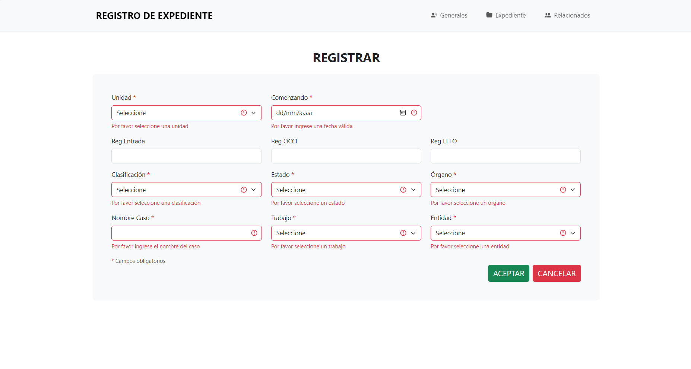

# 📂 Registro de Expedientes - PID IV  

**Autor:** Mario Rivero García  
**Grupo:** 3304  
**Facultad:** FIO  
**Universidad:** Universidad de Ciencias Informáticas, La Habana, Cuba (2025)  

---

## 🚀 Descripción del Proyecto  
Aplicación web desarrollada con **Angular** y **TypeScript** para el registro y gestión de expedientes. El proyecto incluye:  
- 📋 Formularios reactivos con validaciones.  
- 🔄 Enrutamiento dinámico entre componentes.  
- 🎨 Diseño responsive (escritorio y móvil) prototipado en **Figma**.  
- 📊 Gestión de estados y modularización con Angular.  

---

## 🌟 Características  
✅ **Tecnologías utilizadas:**  
- Frontend: Angular 15+, TypeScript, Bootstrap 5.  
- Diseño: Figma (prototipos high-fidelity).  
- Control de versiones: GitHub.  

✅ **Funcionalidades principales:**  
- Registro de expedientes con campos obligatorios/opcionales.  
- Validación de datos (formato fecha, caracteres permitidos, etc.).  
- Navegación entre vistas mediante rutas.  
- Interfaz intuitiva y accesible.  

✅ **Capturas del sistema:**  
|  |  |  
|--------------------------------------|---------------------------------------------|  

---

## 📥 Instalación y Ejecución  
1. **Clonar el repositorio:**  

```bash
git clone https://github.com/1MarioRG3/Registro_Expediente
cd registro-expedientes
```
2. **Instalar dependencias:** 

  ```bash
  npm install
  ```


3. **Ejecutar en modo desarrollo:** 
 ```bash
ng serve
  ```
## 🔗 Enlaces Relevantes

🔗 Repositorio GitHub: [CLICK AQUI](https://github.com/1MarioRG3/Registro_Expediente)

🎨 Prototipo Figma: [CLICK AQUI](https://www.figma.com/design/4rKQqwE0IuWJnRgndtSAIj/Prototipo-Interfaz-Registro_Expediente?node-id=0-1&t=C95NvlUe85iOIma7-1)

🚀 Aplicación desplegada: [CLICK AQUI](https://1mariorg3.github.io/Registro_Expediente)

## 📄 Licencia
Este proyecto está bajo la licencia MIT. Consulte el archivo LICENSE para más detalles.
